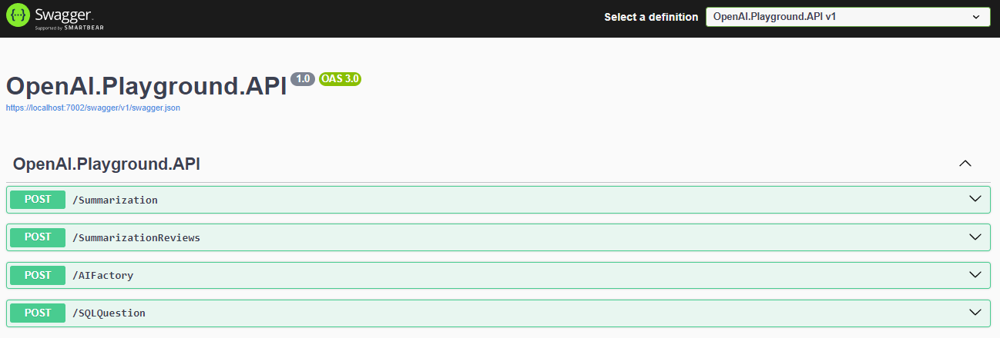

# OpenAI Playground

This repository serves as a playground to test the integration between C# and OpenAI. 

To integrate OpenAI, we use the Azure OpenAI SDK. This SDK provides the `ChatClient` class, which enables seamless interaction with OpenAI's chat-based models, allowing us to generate responses.
For more information on the Azure OpenAI SDK, refer to the official documentation:  
[Azure OpenAI SDK Documentation](https://azuresdkdocs.blob.core.windows.net/$web/dotnet/Azure.AI.OpenAI/1.0.0-beta.8/index.html)

## Prerequisites

Before you can test this project, you need to have an Azure AI Services resource set up. You can find instructions on how to create and configure it here:  
[Get Started with Azure OpenAI](https://learn.microsoft.com/en-us/azure/ai-services/openai/overview)

## Sample Endpoints

Once the project is up and running a Swagger UI page will be generated, where you can interact with various endpoints, similar to the one below:

Here’s a brief description of the available endpoints:

- **(POST) Summarization**: Summarize text in different languages.
- **(POST) SummarizationReview**: Summarize product or service reviews in multiple languages.
- **(POST) AIFactory**: Create a sample "factory" using GPT, which retrieves different types of data based on user queries.
- **(POST) SQLQuestion**: Generate a SQL query using GPT based on user input.

### Basic Concepts in OpenAI

#### **Models**

OpenAI offers a variety of models, each suited to different tasks. Some well-known models include GPT-3, GPT-3.5, and GPT-4. These models are designed to understand and generate human-like text.

You can explore the latest models available on Azure at the following link:  
[OpenAI Models on Azure](https://learn.microsoft.com/en-us/azure/ai-services/openai/concepts/models?tabs=python-secure%2Cglobal-standard%2Cstandard-chat-completions)

#### **Tokens**

In the context of OpenAI, a "token" is the smallest unit of text that the model processes. Tokens can be words, parts of words, or even punctuation marks. For example, the word "ChatGPT" might be split into multiple tokens depending on the model’s configuration. Tokens are a key element in determining how much text is being processed and how long the responses can be.

#### **Prompts**

A **prompt** is the input or instruction given to the AI model to generate a response. Prompts can take various forms, such as questions, statements, or scenarios. The AI responds based on the information and context provided in the prompt, often stimulating creative or informative outputs. Effectively crafting prompts is crucial for obtaining useful and relevant results from the model.

